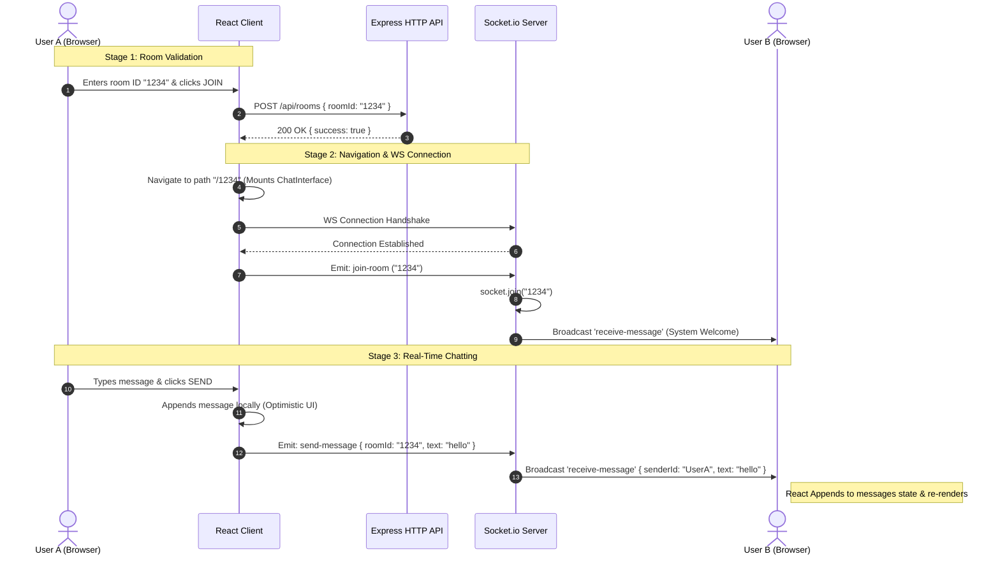

# Room-Based Real-Time Chat App

A lightweight, high-performance real-time chat application built using **React**, **Vite**, **Node.js**, **Express**, and **Socket.io**. The app supports dynamic room-based separation, allowing users to enter custom room numbers and communicate privately in real-time.

---

## 🏗️ Project Architecture

This application uses a decoupled client-server model split between **REST HTTP endpoints** (for initial room validation/registration) and **WebSockets** (for bi-directional, low-latency message streaming).

### 1. Architectural Component Breakdown

* **Frontend Client (Port 5173):**
  * **Routing Layer:** `react-router-dom` handles URL state. The root path `/` displays the `Dashboard` for room selection, and `/:roomId` mounts the dynamic `ChatInterface`.
  * **API Layer:** Uses native browser `fetch` to submit room registration requests to the server's REST API.
  * **Socket Layer:** A persistent WebSocket client (`socket.io-client`) initialized at the file scope to maintain a single, long-lived TCP connection to the backend. Its connection states and room channel subscriptions are managed inside React hooks (`useEffect`) with automated cleanup handlers to prevent memory leaks.

* **Backend Server (Port 8000):**
  * **HTTP Server Wrapper:** Node's native `http.Server` wraps the Express application, allowing it to share the same port (8000) with the Socket.io WebSocket server.
  * **API Routes & Controller (`roomRouter` & `roomController`):** Express routing modules parsing JSON requests (via `express.json()`) and returning status payloads.
  * **CORS Config:** Configured on both Express and Socket.io to allow safe requests originating from the Vite dev server (`http://localhost:5173`).
  * **Socket.io Engine:** Listens for connection handshakes. Upon connection, it coordinates client socket objects, handles channel partitioning (`socket.join`), and broadcasts message frames to specific rooms.

---

### 2. End-to-End Data Flow Sequence

Here is the exact lifecycle of a user joining a room and sending a message:



---

### 3. Room Partitioning & Broadcast Model

Socket.io segments connections into logical channels called **Rooms**. 

1. **Client Isolation:** When a socket client connects, it resides in a default room (its own socket ID). 
2. **Partitioning:** Calling `socket.join(roomId)` on the server maps the client's socket ID to a custom room hash map. 
3. **Targeted Broadcasts:** When sending messages, `socket.to(roomId).emit(...)` ensures that only socket clients registered under that specific room hash map receive the data payload, leaving other channels completely un-interrupted.


---

## 🛠️ Tech Stack

### Frontend
* **Core:** React 19 (TypeScript / TSX)
* **Build Tool:** Vite
* **Routing:** React Router DOM (v6+)
* **WS Client:** Socket.io Client (`socket.io-client`)

### Backend
* **Runtime:** Node.js
* **Framework:** Express
* **WS Server:** Socket.io
* **Dev Utility:** Nodemon (for hot reloading)

---

## 📂 Project Directory Structure

```
Socketio/
├── .gitignore                   # Root gitignore (ignoring node_modules and package files)
└── project1/
    ├── backend/
    │   ├── controller/
    │   │   └── roomController.js # Handles REST room validation/GET endpoints
    │   ├── routes/
    │   │   └── roomRouter.js     # API routing endpoints
    │   ├── package.json
    │   └── server.js            # Entrypoint (Express setup & Socket.io logic)
    │
    └── frontend/
        ├── src/
        │   ├── components/
        │   │   ├── Dashboard.jsx     # Landing page (room entrance)
        │   │   └── ChatInterface.jsx # Real-time chat interface
        │   ├── App.tsx          # Router setup
        │   ├── main.tsx         # App bootstrapping
        │   └── index.css        # Global CSS styles
        └── package.json
```

---

## 🌐 API & WebSocket Documentation

### 1. REST HTTP API

| Method | Endpoint | Description | Request Body | Response Format |
|---|---|---|---|---|
| **POST** | `/api/rooms` | Validates/registers a room session | `{ "roomId": "string" }` | `{ "success": true, "message": "Room joined successfully", "roomId": "string" }` |
| **GET** | `/api/rooms/:roomId` | Verifies status of a room ID | *None* | `{ "message": "getting info from server" }` |

### 2. WebSocket Events (Socket.io)

#### Client-to-Server Events:
* `join-room` (`roomId`): Sent by the client upon mounting the room screen. Instructs the server to place the client's socket channel into the corresponding room partition.
* `send-message` (`messageData`): Emits a new message package to the server.
  ```json
  {
    "roomId": "123",
    "text": "Hello World!",
    "senderId": "socket_connection_id",
    "timestamp": "10:30 PM"
  }
  ```

#### Server-to-Client Events:
* `receive-message` (`messageData`): Distributed by the server to all other clients registered within the room path when a message is sent. Also triggers a system notification when a new user joins:
  ```json
  {
    "senderId": "System",
    "text": "User <socketId> has joined the room.",
    "timestamp": "10:30 PM"
  }
  ```

---

## 🚀 Setup & Installation

### Prerequisites
* Make sure you have [Node.js](https://nodejs.org/) installed (v16+ recommended).

### 1. Run the Backend Server
Navigate to the backend directory, install packages, and start the development server:
```bash
cd project1/backend
npm install
npm run dev # Runs nodemon server.js
```
The server will boot on **http://localhost:8000**.

### 2. Run the Frontend Client
Open a new terminal tab/window, navigate to the frontend directory, install packages, and boot the Vite server:
```bash
cd project1/frontend
npm install
npm run dev
```
The client will boot on **http://localhost:5173**.

---

## 🔍 Troubleshooting & Common Issues

### 1. Port 8000 Already In Use (`EADDRINUSE`)
If you restart your server or make quick modifications, Node may sometimes fail to close the socket bind, leaving an orphaned process occupying port 8000. 

* **On Windows (PowerShell):**
  Find the process ID (PID) running on port 8000:
  ```powershell
  netstat -ano | findstr 8000
  ```
  Kill the process using the PID found (e.g., `12345`):
  ```powershell
  taskkill /F /PID 12345
  ```

* **On Linux / macOS:**
  ```bash
  kill -9 $(lsof -t -i:8000)
  ```

### 2. React Router Hook Error (Blank Page)
If you see an "Invalid Hook Call" or "useNavigate must be used in the context of a Router" error, it means a component is trying to navigate before the `<BrowserRouter>` component has loaded. 
* **Fix:** Ensure `<BrowserRouter>` wraps `<Routes>` in `App.tsx` or `main.tsx` before any page-level navigation components are rendered.

### 3. State Reactivity & Duplicate Event Listeners
When using WebSockets in React, always clean up your listeners! If you don't call `.off(...)` inside the cleanup function of your `useEffect`, React will create duplicate listeners upon hot reloading, leading to duplicated messages in the chat UI.
* **Fix:** Use this hook pattern in your chat component:
  ```javascript
  useEffect(() => {
      socket.on('receive-message', handler);
      return () => {
          socket.off('receive-message', handler); // Clean up!
      };
  }, []);
  ```
